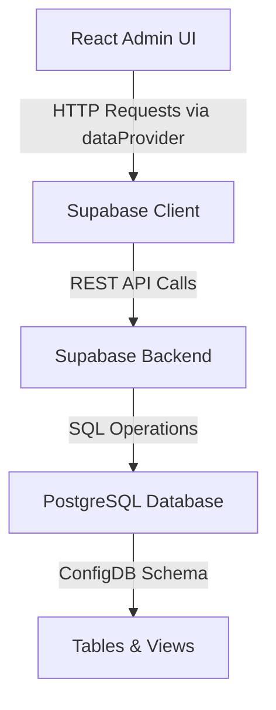
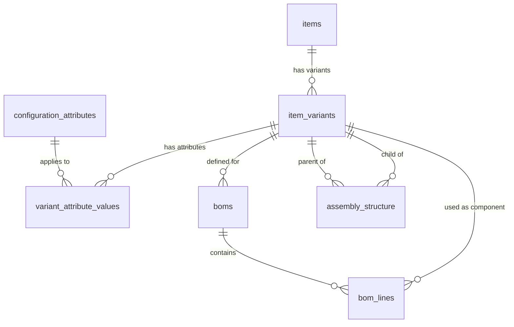

# System Patterns: React Admin with Supabase Integration

## System Architecture

This project implements a three-tier architecture:

1. **Presentation Layer**: React Admin frontend 
2. **API Layer**: Supabase API and SDK integration
3. **Data Layer**: PostgreSQL database with the ConfigDB schema in Supabase

The architecture follows these core patterns:

## Key Technical Decisions

1. **React Admin as the UI Framework**
   - Provides ready-made UI components for CRUD operations
   - Supports complex data relationships and references
   - Offers customizable views, forms, and filters

2. **Supabase as the Backend Service**
   - Combines PostgreSQL database with a REST API
   - Provides authentication and authorization services
   - Includes real-time capabilities (if needed in the future)
   - Simplifies backend development with built-in APIs

3. **Custom Data Provider Integration**
   - Implement a specialized data provider to connect React Admin with Supabase
   - Handle translation between React Admin's data requirements and Supabase's API
   - Support filtering, sorting, and pagination operations

## Database Schema Design

The ConfigDB schema is organized around these core entities and relationships:

### Primary Tables

1. **items**
   - Represents base items (ASY, PCA, COMPONENT, MODULE)
   - Contains fundamental item information (number, type, description)
   - Primary entity that can have multiple variants

2. **item_variants**
   - Represents specific versions of items (e.g., EDU vs Flight variants)
   - Contains variant-specific identifiers and descriptions
   - Links to the parent item through item_id

3. **configuration_attributes**
   - Defines types of attributes that can be assigned to variants
   - Includes common attributes like Environment, Thermal Grade, and Customer

4. **variant_attribute_values**
   - Junction table connecting variants to attribute values
   - Stores the specific values for each attribute per variant

5. **boms**
   - Defines Bill of Materials headers linked to specific variants
   - Contains metadata like revision and description

6. **bom_lines**
   - Stores individual BOM line items
   - Includes quantity and reference designator information
   - Links component variants to BOM headers

7. **assembly_structure**
   - Defines parent-child relationships between variant items
   - Contains assembly-specific information like quantities

### Views

1. **view_variant_details**
   - Provides enriched variant information
   - Combines item and variant data with attribute values
   - Used for selection lists and display purposes

2. **view_assembly_children_details**
   - Shows detailed parent-child relationships
   - Includes environment and thermal grade information
   - Useful for displaying assembly structures

3. **view_full_bom**
   - Provides a complete exploded BOM view
   - Combines header, line item, and component information
   - Essential for BOM management interfaces

## React Admin Resource Mapping

Resources in React Admin will be mapped to database entities as follows:

1. **items Resource**
   - Direct mapping to the items table
   - Includes creation, listing, editing, and deletion capabilities

2. **itemVariants Resource**
   - Maps to the item_variants table with reference to items
   - Displays the parent item details
   - Includes attribute value management

3. **configurationAttributes Resource**
   - Maps to the configuration_attributes table
   - Primarily used for attribute definition and management

4. **boms Resource**
   - Maps to the boms table with reference to item_variants
   - Includes BOM header management

5. **bomLines Resource**
   - Maps to the bom_lines table with references to boms and item_variants
   - Used for BOM component management

6. **assemblyStructure Resource**
   - Maps to the assembly_structure table
   - Manages parent-child relationships between variants

7. **View-based Resources**
   - Specialized resources based on database views
   - Primarily for display and filtering purposes
   - May be read-only depending on view complexity

## Component Relationships

The system implements these relationships through React Admin's reference handling:

1. **One-to-Many Relationships**
   - Items to Variants
   - BOMs to BOM Lines
   - Variants to Attribute Values

2. **Many-to-Many Relationships**
   - Variants to Attributes (through variant_attribute_values)
   - Assembly structures (parent-child relationships between variants)

3. **Reference Implementations**
   - Use React Admin's ReferenceField and ReferenceInput components
   - Implement custom ReferenceArrayField for multi-reference displays
   - Configure appropriate dropdown or autocomplete selectors for references

## Critical Implementation Paths

1. **Data Provider Implementation**
   - Create a custom data provider that maps React Admin operations to Supabase API calls
   - Implement proper handling of relationships and references
   - Support filtering, sorting, and pagination

2. **Resource Definition**
   - Define all required resources with appropriate fields and references
   - Implement custom field components where needed
   - Configure list, edit, create, and show views for each resource

3. **Form Validation**
   - Implement validation rules based on schema constraints
   - Add custom validation for complex business rules
   - Ensure consistent error messaging

4. **Complex View Handling**
   - Determine read/write strategy for view-based resources
   - Implement custom logic for updating through views if needed
   - Create specialized display components for complex data
